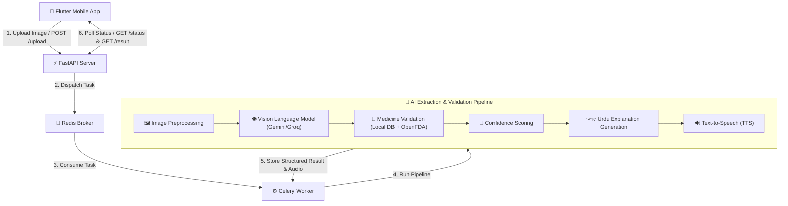

# ParchaAI – AI-Powered Handwritten Prescription Decoder

**ParchaAI** is an advanced, AI-powered healthcare application designed to bridge the gap between complex doctor handwriting and patient understanding. By leveraging Vision Language Models (VLMs), automated validation pipelines, local and OpenFDA drug databases, confidence scoring mechanisms, and localized audio instructions (Urdu Text-to-Speech), ParchaAI turns unreadable handwritten prescriptions into clear, structured, and accessible medical guidance.

---

## 📋 Table of Contents

- [Overview](#-overview)
- [Key Features](#-key-features)
- [System Architecture](#-system-architecture)
- [Technology Stack](#-technology-stack)
- [Repository Structure](#-repository-structure)
- [Data Organization](#-data-organization)
- [Datasets](#-datasets)
- [Preparing the Drug Reference Database](#-preparing-the-drug-reference-database)
- [Prerequisites](#-prerequisites)
- [Backend Installation](#-backend-installation)
- [Flutter Setup](#-flutter-setup)
- [Running the Project](#-running-the-project)
- [Evaluating the Extraction Pipeline](#-evaluating-the-extraction-pipeline)
- [Batch Prediction](#-batch-prediction)
- [Generating Urdu Explanations and Audio](#-generating-urdu-explanations-and-audio)
- [Physical Device Configuration](#-physical-device-configuration)
- [API Overview](#-api-overview)
- [Project Workflow](#-project-workflow)
- [Screenshots](#-screenshots)
- [Future Improvements](#-future-improvements)
- [Medical Disclaimer](#-medical-disclaimer)
- [Acknowledgements / Dataset Attribution](#-acknowledgements--dataset-attribution)
- [Contributors](#-contributors)
- [License](#-license)

---

## 💡 Overview

ParchaAI is designed to address a critical healthcare accessibility problem: unreadable handwritten medical prescriptions. The system performs end-to-end processing across modern mobile, API, distributed background processing, and AI stack layers:

- **Flutter**: Provides a clean, modern, and accessible mobile user interface.
- **FastAPI**: Acts as a high-performance backend REST API gateway.
- **Celery & Redis**: Executes asynchronous tasks for image processing, vision language extraction, validation, and speech synthesis without blocking user experience.
- **AI Models & VLMs**: Harnesses models like Gemini and Groq for handwriting interpretation and structured extraction via Pydantic.
- **Multi-Level Drug Validation**: Verifies extracted drug names, dosages, and instructions against both a local drug reference database (CSV) and the OpenFDA API using fuzzy matching (RapidFuzz).
- **Confidence Scoring**: Flags ambiguous or low-confidence extractions for human review to ensure safety.
- **Urdu Explanations & TTS**: Generates patient-friendly Urdu translations and converts them into spoken audio, ensuring accessibility for non-literate or visually impaired users.

---

## ✨ Key Features

- 📸 **Handwritten Prescription Recognition**: Processes image uploads of medical notes and handwritten prescriptions.
- 🧠 **AI-Powered Medicine Extraction**: Utilizes state-of-the-art Vision Language Models to accurately parse unstructured medical text.
- 📊 **Structured Prescription Parsing**: Returns standardized JSON representations of drug names, dosages, frequencies, and administration instructions.
- 💊 **Local Drug Database Validation**: Cross-checks medications against a curated local drug repository.
- 🌐 **OpenFDA API Validation**: Enriches validation via official FDA pharmaceutical databases.
- 🎯 **Confidence Scoring**: Assigns reliable metrics to extracted fields to detect potential errors.
- 🚩 **Human Review Flagging**: Automatically flags low-confidence predictions for manual verification.
- 🇵🇰 **Urdu Medicine Explanations**: Translates medical jargon into easy-to-understand Urdu guidance.
- 🔊 **Text-to-Speech (TTS) Audio Generation**: Synthesizes Urdu voice instructions for enhanced patient accessibility.
- 📱 **Cross-Platform Mobile Application**: Built with Flutter for smooth mobile interaction.
- ⚡ **Asynchronous Background Processing**: Offloads heavy AI and audio workflows to Celery worker threads backed by Redis.
- 🔌 **RESTful API Architecture**: Built with FastAPI for scalable endpoints and clean API contracts.

---

## 🏗️ System Architecture



---

## 🛠️ Technology Stack

| Category | Technologies / Frameworks |
| :--- | :--- |
| **Frontend** |   |
| **Backend** |     |
| **AI / Machine Learning** | Gemini VLM, Groq, RapidFuzz, Pydantic, gTTS / Edge-TTS |
| **Databases & APIs** | SQLite, Local Drug Reference CSV, OpenFDA API |
| **Development Tools** | Git, GitHub, VS Code, Android Studio |

---

## 📁 Repository Structure

```text
ParchaAI/
├── data/                      # Local drug datasets, raw images, and annotations
├── datasets/                  # Dataset preprocessing utilities & cleaned drug database
├── parcha_ai/                 # Backend core package
│   ├── __init__.py
│   ├── api.py                 # FastAPI endpoints & request routers
│   ├── celery_app.py          # Celery configuration & initialization
│   ├── celery_tasks.py        # Asynchronous task definitions
│   ├── confidence.py          # Confidence calculation algorithms
│   ├── config.py              # Application settings & environment configuration
│   ├── database.py            # Database utilities and connections
│   ├── evaluation.py          # Benchmark and accuracy metrics script
│   ├── extraction.py          # Vision Language Model extraction logic
│   ├── fuzzy_match.py         # RapidFuzz matching for drug names
│   ├── main.py                # Command-line entry points / execution scripts
│   ├── openfda.py             # OpenFDA API integration client
│   ├── pipeline.py            # Master prescription decoding pipeline orchestration
│   ├── preprocessing.py       # Image clean-up, deskewing, and contrast enhancements
│   ├── prompts.py             # Prompt engineering templates for VLMs
│   ├── text_to_speech.py      # Audio generation logic for Urdu instructions
│   ├── urdu_explanation.py    # Translation and simplified medical text generator
│   ├── urdu_pipeline.py       # Urdu-specific processing workflow
│   ├── utils.py               # Shared utility functions
│   └── validation.py          # Multi-source medicine validation module
├── parcha_ai_app/             # Flutter cross-platform mobile application
├── outputs/                   # Generated results, audio files, and processed output
├── scripts/                   # Helper scripts for batch translation and audio synthesis
├── .env                       # Environment variables (API keys, settings)
├── requirements.txt           # Python backend dependencies
└── README.md                  # Project documentation
```

---

## 📂 Data Organization

The project organizes data assets and preprocessing logic into distinct folders:

- **`data/`**: Contains core project assets including handwritten prescription images, ground truth annotations (`ground_truth.csv`), the raw medicine reference database, and runtime generated data.
- **`datasets/`**: Contains dataset cleaning scripts, data preparation utilities, and the cleaned medicine reference database generated from raw sources.

---

## 📊 Datasets

ParchaAI incorporates publicly available Kaggle datasets for research, development, and educational purposes to train, evaluate, and validate the extraction pipeline.

### 1. Handwritten Prescription Images
- **Source**: [Illegible Medical Prescription Images Dataset (Kaggle)](https://www.kaggle.com/datasets/mehaksingal/illegible-medical-prescription-images-dataset)
- **Usage**: This dataset provides real-world handwritten prescription images used during the development, testing, and evaluation of the Vision Language Model extraction pipeline.

### 2. Medicine Reference Database
- **Source**: [11,000 Medicine Details (Kaggle)](https://www.kaggle.com/datasets/singhnavjot2062001/11000-medicine-details)
- **Usage**: Serves as the local medicine reference database used for local drug validation and fuzzy matching. The raw dataset is thoroughly cleaned and standardized before being consumed by the pipeline.

---

## 🧹 Preparing the Drug Reference Database

Before running the AI pipeline or evaluation suite, clean and prepare the raw medicine dataset using the included preprocessing utility:

```bash
python datasets/clean_dataset.py
```

This cleaning script performs the following operations:
- Removes unnecessary and irrelevant columns.
- Handles missing or null values across drug fields.
- Standardizes text formatting and case consistency.
- Removes duplicate drug entries.
- Produces a sanitized, high-performance drug reference database (`datasets/`) ready for rapid fuzzy matching during extraction.

---

## ⚡ Prerequisites

Ensure you have the following installed on your system before setting up the project:

- **Python**: `3.11` or higher
- **Flutter SDK**: `3.x` stable release
- **Android Studio** / **VS Code** with Flutter & Dart plugins
- **Redis Server**: Version 6.x or newer
- **Git**: Installed and configured

---

## 💻 Backend Installation

Follow these steps to set up the backend server:

1. **Clone the repository:**
   ```bash
   git clone <repository-url>
   cd ParchaAI
   ```

2. **Create a virtual environment:**
   ```bash
   python -m venv venv
   ```

3. **Activate the virtual environment:**
   - **Windows:**
     ```powershell
     venv\Scripts\activate
     ```
   - **Linux / macOS:**
     ```bash
     source venv/bin/activate
     ```

4. **Install backend dependencies:**
   ```bash
   pip install -r requirements.txt
   ```

---

## 📱 Flutter Setup

Navigate to the mobile app directory and retrieve the required Flutter dependencies:

```bash
cd parcha_ai_app
flutter pub get
```

---

## 🚀 Running the Project

Running **ParchaAI** requires launching **four terminal windows** to manage Redis, Celery tasks, FastAPI server, and Flutter app simultaneously.

<details>
<summary><b>Click to expand multi-terminal launch commands</b></summary>

<br/>

### Terminal 1: Redis Broker
```bash
redis-server
```

### Terminal 2: Celery Worker
```bash
celery -A parcha_ai.celery_app worker --loglevel=info --concurrency=2
```

### Terminal 3: FastAPI Backend
```bash
uvicorn parcha_ai.api:app --reload --host 0.0.0.0 --port 8000
```

### Terminal 4: Flutter Mobile App
```bash
cd parcha_ai_app
flutter run
```

</details>

---

## 📈 Evaluating the Extraction Pipeline

To evaluate the precision and performance of the prescription extraction models against ground truth annotations, run the evaluation command:

```bash
python -m parcha_ai.main evaluate
```

This command compares model outputs against the annotated `ground_truth.csv` file and generates a comprehensive performance report detailing:
- **Precision**
- **Recall**
- **F1-Score**
- **Extraction Accuracy**
- **Pipeline Execution Statistics**

---

## 📦 Batch Prediction

To process a directory containing multiple prescription images at once, execute the batch prediction command:

```bash
python -m parcha_ai.main batch ./data/raw_images/ -o ./output/predictions/
```

This utility passes every prescription image inside `./data/raw_images/` through the full preprocessing, VLM extraction, drug validation, and confidence scoring pipeline, outputting structured JSON prediction files into `./output/predictions/`.

---

## 🔊 Generating Urdu Explanations and Audio

To generate Urdu explanations and synthesize speech audio files in bulk for test or evaluation datasets, run:

```bash
python scripts/generate_urdu_audio_batch.py --n-images 27
```

This script:
- Generates patient-friendly Urdu translations and instructions for each extracted prescription.
- Synthesizes clear audio for individual medications.
- Produces a unified audio summary for the complete prescription.
- Pre-generates localized translations and audio files across evaluation datasets during development.

---

## 📲 Physical Device Configuration

When running and testing the Flutter mobile app on a **physical Android device** instead of an emulator:

1. Connect both your development computer and your Android smartphone to the **same Wi-Fi network**.
2. Identify your laptop's local IP address (e.g., `192.168.1.50`).
3. Update the API base URL in the Flutter configuration file (`parcha_ai_app`) from `localhost` / `127.0.0.1` to your laptop's LAN IP address:
   ```text
   http://192.168.x.x:8000
   ```

> [!WARNING]
> `localhost` or `127.0.0.1` refers to the mobile phone itself when executing on a physical device. You **must** set the local IP address for network communication to succeed.

---

## 📡 API Overview

FastAPI provides interactive API documentation accessible via `/docs` or `/redoc` when running the server.

| Endpoint | Method | Description |
| :--- | :---: | :--- |
| `/upload` | `POST` | Uploads a prescription image and initiates asynchronous decoding. |
| `/status/{id}` | `GET` | Retrieves current job processing status (`PENDING`, `SUCCESS`, `FAILED`). |
| `/result/{id}` | `GET` | Fetches parsed JSON results, confidence metrics, and audio reference path. |
| `/prescription/{id}` | `DELETE` | Removes processed prescription data and associated cached files. |
| `/health` | `GET` | Health check endpoint returning server and dependency status. |
| `/audio/{filename}` | `GET` | Streams synthesized Urdu audio instruction files. |

---

## 🔄 Project Workflow


---

## ⚠️ Medical Disclaimer

> [!CAUTION]
> **ParchaAI is designed solely as an assistive software tool.** It is **not** a substitute for professional medical advice, diagnosis, or treatment. Patients and users must **always** verify medication details, dosages, and instructions with a qualified healthcare professional, doctor, or pharmacist before consuming any prescribed drugs.

---

## 🙏 Acknowledgements / Dataset Attribution

ParchaAI gratefully acknowledges the creators and maintainers of the open-source datasets that made this project possible:

- **Illegible Medical Prescription Images Dataset**: Created by Mehak Singal and hosted on [Kaggle](https://www.kaggle.com/datasets/mehaksingal/illegible-medical-prescription-images-dataset). Used for prescription extraction model development and testing.
- **11,000 Medicine Details Dataset**: Created by Navjot Singh and hosted on [Kaggle](https://www.kaggle.com/datasets/singhnavjot2062001/11000-medicine-details). Used as the core local medicine reference database.

*All rights and credit for these datasets belong entirely to their respective original creators. ParchaAI utilizes these datasets strictly for academic research, educational, and project development purposes.*

---

## 👥 Contributors

Contributions, issues, and feature requests are welcome! Feel free to check the [issues page](https://github.com/yourusername/ParchaAI/issues).

---

## 📄 License

This project is licensed under the [MIT License](LICENSE).
