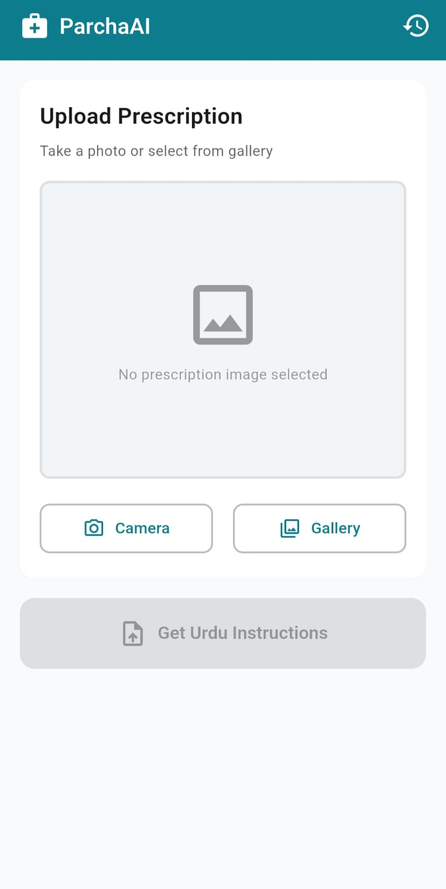
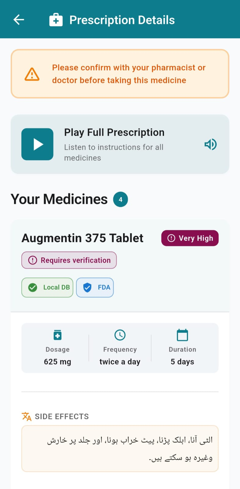
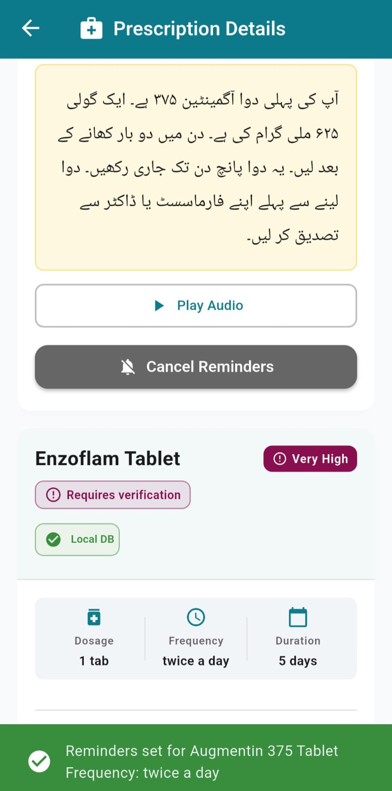
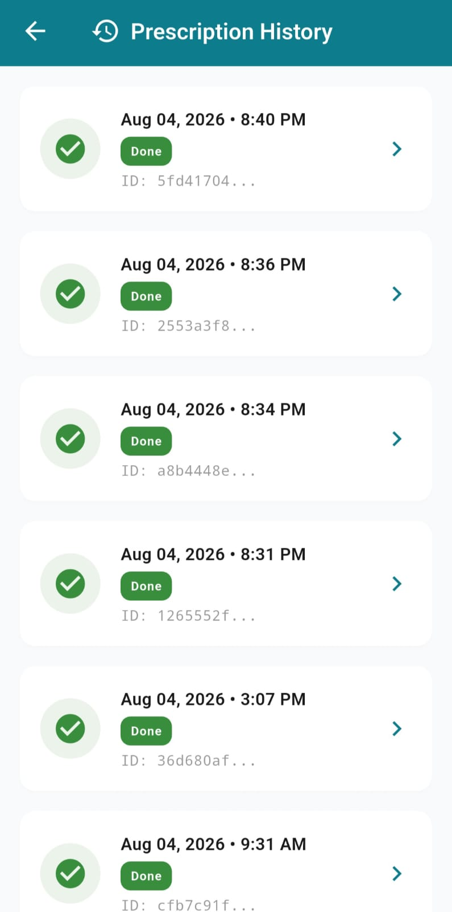

# ParchaAI – AI-Powered Prescription Understanding System

**ParchaAI** is an end-to-end healthcare accessibility solution that transforms handwritten medical prescriptions into structured, understandable medication guidance. Designed for patients with limited English literacy or visual impairments, ParchaAI uses AI to read doctor's handwriting, validates medicines against comprehensive databases, explains prescriptions in Urdu (both text and audio), and provides medication reminders — ensuring patients understand what to take, when, and why.

---

## 💡 What ParchaAI Does

1. **📸 Photograph** — Patient takes a photo of their handwritten prescription
2. **🧠 Extract** — AI reads the prescription and extracts medicine names, dosages, frequencies, and instructions
3. **✅ Validate** — Cross-checks medicines against a local 11,500+ medicine database and OpenFDA
4. **🎯 Score** — Calculates confidence scores and flags low-confidence items for human review
5. **🇵🇰 Explain** — Generates patient-friendly Urdu explanations with pronunciation-aware text
6. **🔊 Speak** — Converts explanations to Urdu audio (MP3) for patients who cannot read
7. **💊 Remind** — Schedules medication reminders based on prescribed frequency
8. **📚 Track** — Maintains prescription history for easy reference

### Who It's For
- **Patients** with limited English literacy who struggle to read prescription labels
- **Caregivers** managing medications for elderly family members
- **Visually impaired patients** who need audio guidance
- **Anyone** with a handwritten prescription that's difficult to decipher

### Why It Matters
Medication errors due to unreadable prescriptions or misunderstood instructions are a serious patient safety issue, especially in regions where multilingual medical care is common. ParchaAI bridges the language and literacy gap between doctors and patients.

---

## 📸 Screenshots

| Home | Result | Reminders | History |
|:---:|:---:|:---:|:---:|
|  |  |  |  |
| Upload prescription image | View extracted medicines with Urdu audio | Set medication reminders | Browse prescription history |

---

## ✨ Features

### Core Extraction & Validation
- **📝 Two-Pass AI Extraction** — Primary extraction via Gemini Vision, fallback to Groq for additional verification
- **💊 Dual-Source Medicine Validation** — Local database (~11,500 Pakistani medicines) + OpenFDA API cross-validation
- **🎯 Confidence Scoring** — Automatic scoring (0-1 scale) for each extracted field
- **🚩 Human Review Flagging** — Low-confidence extractions (<0.85) flagged for manual pharmacist review
- **🔍 Fuzzy Matching** — RapidFuzz matching handles spelling variations and doctor handwriting inconsistencies

### Urdu Localization & Accessibility
- **🇵🇰 Urdu Text Explanations** — LLM-generated patient-friendly Urdu instructions per medicine
- **🗣️ 3-Tier Pronunciation Engine**:
  1. Manual pronunciation dictionary (growing)
  2. LLM-based phonetic generation (Groq/Llama)
  3. Phoneme-based fallback (g2p_en + NLTK)
- **🔊 Urdu Audio Generation** — gTTS text-to-speech for every medicine (individual + combined prescription audio)
- **⚠️ Side Effects Summary** — Urdu summaries of side effects/precautions (only shown when data is available)
- **📢 Safety Disclaimer** — "Please confirm with your pharmacist or doctor" included in every audio clip

### Mobile App Features
- **📱 Flutter Cross-Platform** — iOS and Android support
- **📷 Camera + Gallery** — Capture new photo or select existing prescription image
- **⏰ Smart Medication Reminders** — Frequency-aware notifications (skips "as needed" / PRN medicines)
- **🕒 Pakistan Time Zone** — Reminders scheduled in PKT (Asia/Karachi)
- **📚 Prescription History** — Persistent local storage of past prescriptions
- **♿ Accessibility** — Audio playback for visually impaired users, right-to-left Urdu text display

### Backend Architecture
- **⚡ FastAPI REST API** — High-performance async endpoints
- **🔄 Celery + Redis** — Background task processing for heavy AI operations
- **🗄️ PostgreSQL (Production) / SQLite (Dev)** — Prescription data persistence
- **🔐 CORS Enabled** — Configurable for mobile app integration
- **🎵 Static File Serving** — Generated Urdu MP3 files served directly

---

## 🏗️ Architecture

```
┌─────────────────┐
│  📱 Flutter App │ (Upload image, display results, play audio, set reminders)
└────────┬────────┘
         │ HTTP POST /upload
         ▼
┌─────────────────┐
│  ⚡ FastAPI API │ (Receive upload, enqueue task, serve results)
└────────┬────────┘
         │ Task dispatch
         ▼
┌─────────────────┐
│  🔴 Redis Queue │ (Task broker)
└────────┬────────┘
         │ Consume task
         ▼
┌─────────────────────────────────────────────────────────────┐
│  ⚙️ Celery Worker (ParchaAI Pipeline)                      │
│  ┌─────────────────────────────────────────────────────┐   │
│  │  1. 🖼️  Image Preprocessing (contrast, resize)      │   │
│  │  2. 👁️  Gemini Vision Extraction (two-pass)         │   │
│  │  3. 💊 Medicine Validation (local DB + OpenFDA)     │   │
│  │  4. 🎯 Confidence Scoring                           │   │
│  │  5. 🇵🇰 Urdu Explanation Generation (Groq/Llama)    │   │
│  │  6. 🗣️  Pronunciation Engine (3-tier fallback)      │   │
│  │  7. 🔊 Text-to-Speech (gTTS → MP3)                  │   │
│  │  8. 💾 Save results to database                     │   │
│  └─────────────────────────────────────────────────────┘   │
└─────────────────────────────────────────────────────────────┘
         │ Task complete
         ▼
┌─────────────────┐
│  📱 Flutter App │ (Poll GET /status → GET /result → display + play audio)
└─────────────────┘
```

---

## 🛠️ Technology Stack

### Backend
- **Python 3.11+** — Core language
- **FastAPI** — REST API framework
- **Celery** — Distributed task queue
- **Redis** — Message broker
- **PostgreSQL** (production) / **SQLite** (local dev) — Database
- **Pydantic** — Data validation and structured extraction schemas

### AI & ML
- **Gemini Vision (gemini-1.5-flash-lite)** — Primary handwriting extraction
- **Groq (qwen3.6-27b)** — Fallback extraction + Urdu generation
- **Groq (llama-3.3-70b-versatile)** — Urdu explanation generation
- **RapidFuzz** — Fuzzy string matching for medicine names
- **gTTS (Google Text-to-Speech)** — Urdu audio synthesis
- **g2p_en + NLTK** — Phoneme-based pronunciation fallback

### Frontend
- **Flutter 3.x** — Cross-platform mobile framework
- **Dart** — Programming language
- **image_picker** — Camera + gallery access
- **audioplayers** — Audio playback
- **flutter_local_notifications** — Medication reminders
- **http** — API client
- **shared_preferences** — Local storage

### Data Sources
- **Local Drug Database** — ~11,500 cleaned Pakistani medicines (from Kaggle)
- **OpenFDA API** — Official FDA pharmaceutical data for validation

---

## 📁 Project Structure

```
ParchaAI/
├── parcha_ai_backend/         # Backend Python package
│   ├── api.py                 # FastAPI endpoints
│   ├── celery_app.py          # Celery configuration
│   ├── celery_tasks.py        # Background task definitions
│   ├── pipeline.py            # Main extraction orchestration
│   ├── extraction.py          # Gemini Vision + Groq extraction
│   ├── validation.py          # Pydantic schemas
│   ├── fuzzy_match.py         # RapidFuzz medicine matching
│   ├── openfda.py             # OpenFDA API client
│   ├── confidence.py          # Confidence scoring logic
│   ├── urdu_explanation.py    # Urdu text generation
│   ├── pronunciation.py       # 3-tier pronunciation engine
│   ├── text_to_speech.py      # gTTS audio generation
│   ├── urdu_pipeline.py       # Urdu-specific workflow
│   ├── medical_text_summarizer.py  # Side effects summarization
│   ├── preprocessing.py       # Image processing
│   ├── config.py              # Environment config
│   ├── database.py            # SQLite/PostgreSQL utilities
│   ├── evaluation.py          # Accuracy benchmarking
│   └── main.py                # CLI entry point
│
├── parcha_ai_app/             # Flutter mobile app
│   ├── lib/
│   │   ├── main.dart          # App entry point
│   │   ├── home_screen.dart   # Upload screen
│   │   ├── result_screen.dart # Medicine display + audio + reminders
│   │   ├── history_screen.dart # Past prescriptions
│   │   ├── api_service.dart   # HTTP client
│   │   ├── reminder_service.dart # Notification scheduling
│   │   ├── models.dart        # Data models
│   │   └── theme.dart         # UI styling
│   ├── android/               # Android platform code
│   ├── ios/                   # iOS platform code
│   └── pubspec.yaml           # Flutter dependencies
│
├── drug_database/             # Medicine reference data
│   ├── drug_reference_db.csv  # Cleaned 11,500+ medicine dataset
│   └── clean_dataset.py       # Dataset preprocessing script
│
├── data/                      # Runtime data
│   ├── raw_images/            # Test prescription images
│   ├── labels/                # Ground truth annotations
│   └── parcha_ai.db           # SQLite database (local dev)
│
├── outputs/                   # Generated results
│   ├── audio/                 # Generated Urdu MP3 files
│   └── *.json                 # Extraction results
│
├── screenshots/               # App screenshots (for README)
│   ├── home_screen.png
│   ├── result_screen.png
│   ├── reminder_screen.png
│   └── history_screen.png
│
├── scripts/                   # Utility scripts
├── cache/                     # LLM response cache
├── logs/                      # Application logs
├── .env                       # Environment variables (DO NOT COMMIT)
├── .env.example               # Environment template
├── requirements.txt           # Python dependencies
├── Dockerfile                 # Container image definition
└── README.md                  # This file
```

---

## 🚀 Local Setup Instructions

### Prerequisites
- **Python 3.11+** installed
- **Flutter SDK 3.x** installed
- **Redis** server installed and running
- **Git** installed
- **Android Studio** or **VS Code** with Flutter/Dart plugins (for mobile development)

### 1. Clone Repository
```bash
git clone https://github.com/yourusername/ParchaAI.git
cd ParchaAI
```

### 2. Backend Setup

#### Create Virtual Environment
```bash
python -m venv .venv
```

#### Activate Virtual Environment
**Windows (PowerShell):**
```powershell
.venv\Scripts\activate
```

**Linux/macOS:**
```bash
source .venv/bin/activate
```

#### Install Dependencies
```bash
pip install -r requirements.txt --break-system-packages
```

> **Note:** `--break-system-packages` may be needed on some systems where pip refuses to install outside a virtual environment.

#### Download NLTK Data
```bash
python -c "import nltk; nltk.download('cmudict')"
```

#### Configure Environment Variables
Copy `.env.example` to `.env` and fill in your API keys:
```bash
cp .env.example .env
```

Edit `.env` with your actual values:
```env
GROQ_API_KEY=your_groq_api_key_here
GEMINI_API_KEY=your_gemini_api_key_here
REDIS_URL=redis://localhost:6379/0
DATABASE_URL=sqlite:///./data/parcha_ai.db
# ... (see Environment Variables section below)
```

#### Prepare Drug Database
```bash
python drug_database/clean_dataset.py
```

### 3. Flutter App Setup
```bash
cd parcha_ai_app
flutter pub get
cd ..
```

### 4. Start Services (4 Terminal Windows)

**Terminal 1 — Redis:**
```bash
redis-server
```

**Terminal 2 — Celery Worker:**
```bash
celery -A parcha_ai_backend.celery_app worker --loglevel=info --concurrency=2
```

**Terminal 3 — FastAPI Server:**
```bash
uvicorn parcha_ai_backend.api:app --reload --host 0.0.0.0 --port 8000
```

**Terminal 4 — Flutter App:**
```bash
cd parcha_ai_app
flutter run
```

> **Physical Device:** When testing on a real phone (not emulator), update `api_service.dart` to use your laptop's LAN IP (e.g., `http://192.168.1.50:8000`) instead of `localhost`. Both devices must be on the same Wi-Fi network.

---

## 🔐 Environment Variables

Create a `.env` file based on `.env.example`. Required variables:

| Variable | Purpose | Example |
|:---------|:--------|:--------|
| `GROQ_API_KEY` | Groq API authentication | `gsk_...` |
| `GEMINI_API_KEY` | Google Gemini API authentication | `AIza...` |
| `REDIS_URL` | Redis connection string | `redis://localhost:6379/0` |
| `DATABASE_URL` | Database connection (optional for prod) | `postgresql://...` or empty for SQLite |
| `DB_PATH` | SQLite path (local dev) | `./data/parcha_ai.db` |
| `OPENFDA_API_URL` | OpenFDA endpoint | `https://api.fda.gov/drug/label.json` |
| `GEMINI_MODEL_NAME` | Vision model name | `gemini-1.5-flash-lite` |
| `GROQ_MODEL_NAME` | Extraction fallback model | `qwen/qwen3.6-27b` |
| `URDU_MODEL` | Urdu explanation model | `llama-3.3-70b-versatile` |
| `CONFIDENCE_THRESHOLD` | Low-confidence flag threshold | `0.85` |
| `URDU_TTS_SLOW` | Slow down gTTS audio | `false` |
| `LOG_LEVEL` | Logging verbosity | `INFO` |

> **Security:** Never commit `.env` to version control. `.gitignore` should include `.env`.

---

## 📡 API Endpoints

FastAPI provides interactive docs at `http://localhost:8000/docs`

| Endpoint | Method | Description |
|:---------|:------:|:------------|
| `/upload` | POST | Upload prescription image (multipart/form-data) |
| `/status/{prescription_id}` | GET | Check processing status (pending/processing/done/failed) |
| `/result/{prescription_id}` | GET | Get full result (medicines, Urdu text, audio URLs) |
| `/audio/{filename}` | GET | Serve generated MP3 audio files |
| `/prescription/{prescription_id}` | DELETE | Delete prescription and associated data |
| `/health` | GET | Health check endpoint |

### Upload Flow
```
POST /upload → returns {prescription_id, status: "pending"}
  ↓
GET /status/{id} (poll every 2-3s) → {status: "processing"} ... → {status: "done"}
  ↓
GET /result/{id} → Full result with medicines, audio URLs, confidence scores
```

---

## 🧪 CLI Commands

### Process Single Prescription
```bash
python -m parcha_ai_backend.main process data/raw_images/rx_01.jpg
```

### Batch Process Multiple Prescriptions
```bash
python -m parcha_ai_backend.main batch data/raw_images/ -o outputs/
```

### Evaluate Against Ground Truth
```bash
python -m parcha_ai_backend.main evaluate
```

Compares extractions against `data/labels/ground_truth.csv` and outputs accuracy metrics.

---

## 🚢 Deployment

### Backend Deployment (Railway)

**Services deployed:**
1. **FastAPI app** — Main API server
2. **Celery worker** — Background task processor
3. **Redis** — Task queue (Railway add-on)
4. **PostgreSQL** — Production database (Railway add-on)

**Configuration:**
- Set all `.env` variables in Railway dashboard
- Deploy via GitHub integration (auto-deploy on push to `main`)
- Ensure both FastAPI and Celery services run from same codebase
- Enable persistent volume if possible (currently using base64-in-DB workaround for cross-container file sharing)

**Railway Quirks:**
- No shared filesystem between FastAPI and Celery containers → audio files stored as base64 in database
- Redis and Postgres use Railway internal URLs (automatically injected)

### Frontend Deployment (Firebase App Distribution)

**Build release APK:**
```bash
cd parcha_ai_app
flutter clean
flutter pub get
flutter build apk --release
```

**Upload to Firebase:**
```bash
firebase appdistribution:distribute build/app/outputs/flutter-apk/app-release.apk \
  --app YOUR_FIREBASE_APP_ID \
  --groups testers
```

**Production Considerations:**
- Use proper signing keys (not debug keys)
- Update API base URL to production backend
- Tighten CORS policy on backend
- Enable ProGuard/R8 optimization (already configured)

---

## 📊 Dataset

### Local Drug Reference Database
- **Source:** [11,000 Medicine Details (Kaggle)](https://www.kaggle.com/datasets/singhnavjot2062001/11000-medicine-details)
- **Cleaned rows:** ~11,500 medicines (from ~11,800 raw rows)
- **Content:** Pakistani medicines with composition, manufacturer, dosage forms
- **Processing:** `drug_database/clean_dataset.py` removes duplicates, standardizes formatting

### Prescription Images (Dev/Test)
- **Source:** [Illegible Medical Prescription Images (Kaggle)](https://www.kaggle.com/datasets/mehaksingal/illegible-medical-prescription-images-dataset)
- **Usage:** Pipeline development, testing, evaluation
- **Format:** JPEG handwritten prescription photos

---

## ⚠️ Known Limitations & Future Work

### Current Limitations
1. **Pronunciation Dictionary** — Manual dictionary still growing; some medicine names may have suboptimal Urdu transliteration
2. **No User Authentication** — No user accounts; prescriptions are device-local only
3. **File Sharing in Deployment** — Production uses base64-in-DB workaround due to Railway's lack of persistent shared volumes
4. **Single-User App** — No cloud sync or multi-device support
5. **Limited Side Effects Data** — Summarization only shown when source data is available

### Future Improvements
- **User Accounts** — Cloud-based prescription storage with authentication
- **OCR Fallback** — Add traditional OCR (Tesseract) as additional extraction layer
- **Multi-Language Support** — Add Hindi, Sindhi, Punjabi translations
- **Pharmacist Review Portal** — Web dashboard for flagged prescriptions
- **Offline Mode** — Cache common medicines for offline extraction
- **Drug Interaction Warnings** — Check for dangerous drug combinations
- **Refill Reminders** — Track prescription duration and notify before medication runs out
- **Voice Input** — Allow patients to describe symptoms for better context

---

## 🩺 Medical Disclaimer

> **⚠️ IMPORTANT:** ParchaAI is a **software tool for informational purposes only**. It is **NOT** a substitute for professional medical advice, diagnosis, or treatment. Always:
> - Verify extracted information with your prescription label
> - Consult your doctor or pharmacist before taking any medication
> - Follow your healthcare provider's instructions
> - Do NOT rely solely on AI-generated explanations for medical decisions

Medication errors can be life-threatening. When in doubt, ask a healthcare professional.

---

## 🙏 Acknowledgements

### Datasets
- **Illegible Medical Prescription Images** by Mehak Singal ([Kaggle](https://www.kaggle.com/datasets/mehaksingal/illegible-medical-prescription-images-dataset))
- **11,000 Medicine Details** by Navjot Singh ([Kaggle](https://www.kaggle.com/datasets/singhnavjot2062001/11000-medicine-details))

### Technologies
- **Google Gemini** for vision-language models
- **Groq** for fast LLM inference
- **OpenFDA** for pharmaceutical data
- **Flutter** community for excellent mobile framework
- **FastAPI** and **Celery** communities

All credit for datasets belongs to their original creators. Used for educational/research purposes.

---

## 👥 Contributing

Contributions are welcome! Areas for contribution:
- Expanding the Urdu pronunciation dictionary
- Adding more medicine names to the local database
- Improving extraction prompt engineering
- Adding unit tests
- Creating a pharmacist review portal
- Adding new language support

Please open an issue before starting major work to discuss the approach.

---

## 📄 License

This project is licensed under the [MIT License](LICENSE).

---

## 📞 Support

For questions, issues, or feedback:
- Open an [issue](https://github.com/yourusername/ParchaAI/issues)
- Check [existing issues](https://github.com/yourusername/ParchaAI/issues?q=is%3Aissue) before creating a new one

---

**Built with ❤️ for patient safety and healthcare accessibility**
